<aside>
🔖

- 목차
</aside>

# 1. 데이터 전처리

## 1-1. 데이터 구조

<aside>

### ① 데이터 입도와 규모

| 항목 | 값 |
| --- | --- |
| 수집 시점 | 2026년 6–7월 (지역마다 다름 — 부록) |
| 원본 | **842,655행 × 50열** (약 1.06GB) |
| 입도 | 1행 = 숙소 1개의 한 시점 스냅샷 (시계열 아님) |
| 범위 | 19개국 · 53개 지역 (`region`이 분석 단위) |
| 호스트 | 435,745명 — **77.4%가 1채만 보유**, 10채 이상 호스트가 매물의 26.1% |
| 기본키 | `id` 완전 고유 (중복 0) |
| 없는 정보 | **예약 건수 · 매출 컬럼이 없음** → 거래의 흔적은 리뷰뿐 (2-3에서 다룸) |

- 상세
    - `name` · `description` 두 텍스트 컬럼이 용량의 대부분이라 분석에서 제외 (필요하면 `id`로 원본과 머지)
    - 마스터 데이터는 `scripts/build_master.py`가 생성: **841,626행 × 89열**
</aside>

---

## 1-2. 이상치 처리

<aside>

### ① 절대 가격이 아닌 1인당 가격으로 판단

**ⅰ. 절대 가격 기준의 문제**

- `price > 2,000€`로 자르면 3,799건이 걸리는데, 이 중 2,000–3,000€ 구간(1,877건)은 **8인 빌라 · 1인당 281€**인 산토리니 · 마요르카 · 파리 매물
- 자르면 고가 빌라 세그먼트가 통째로 사라짐 → 마요르카가 숙소당 매출 상위인 근거도 사라짐

**ⅱ. 1인당 가격 + 거래 여부**

- `price_per_person = price / accommodates`
- **1인당 1,000€ 초과 & 최근 1년 거래 없음** → 593건 삭제
- 1인당 1,000€ 초과여도 **최근 1년 리뷰가 있으면 남김** (예: 베네치아 2인실 2,018€, 최근 1년 리뷰 6건)

**조건을 두 개로 건 이유**

- 1인당 가격만으로 자르면 744건이 걸리는데, 이 중 **352건(47.3%)은 리뷰가 있음** = 실제로 팔린 매물
- "비싸다"는 이유로 팔리는 매물을 지우지 않기 위해 거래 여부를 함께 봄

- 상세 — 입력 오류로 보는 근거
    - 1인당 1,000€ 초과 744건의 리뷰 0건 비율 52.7% (전체 18.2%)
    - `price`가 1,000의 배수인 비율 8.9% (전체 0.04%) → 자릿수 오타 · 장기 총액을 1박 칸에 기재
    - 통화 미환산은 아님: 1,000€ 초과 건이 19개국에 0.0–0.3%로 고르게 분포
</aside>

<aside>

### ② 논리적으로 불가능한 설정 제거

| 규칙 | 건수 | 이유 |
| --- | ---: | --- |
| `price` > 10,000€ | 235 | 어떤 인원으로 나눠도 설명 불가 (런던 611,870€ 등) |
| `minimum_nights` > 365 | 156 | 단기 숙박 상품이 아님 |
| `minimum_nights` > `maximum_nights` | 48 | "최소 30박, 최대 7박" — 예약 불가능한 설정 |

→ 결측 삭제(139건)와 합쳐 **총 1,029건 (0.12%) 삭제**, 중복 조건 제외
</aside>

<aside>

### ③ 지우지 않고 표시만 한 것

"이상해 보인다"와 "틀렸다"는 다름. 안 팔리는 매물 · 유령 매물은 **우리가 찾아야 할 문제 그 자체**라 지우면 결론이 사라짐

| 플래그 | 건수 | 내용 |
| --- | ---: | --- |
| `flag_price_under_10` | 4,154 | 이스탄불 · 최소 365박 · 리뷰 0건 · 연중 예약 가능 = 노출만 노린 **유령 매물** |
| `flag_calendar_blocked` | 103,427 | 향후 90일이 전부 닫혔는데 1년간 거래 없음 = 만실이 아니라 **막아 둔 달력** |
| `flag_max_nights_default` | 284,491 | `maximum_nights = 1125` = 플랫폼 기본값 (호스트가 설정 안 함) |
| `flag_price_over_2000` · `flag_beds_over_20` 등 | 소수 | 고가 빌라 · 건물 단위 리스팅 — 설명 가능한 실제 현상 |
</aside>

---

## 1-3. 결측치 처리

<aside>

### ① 행 삭제: `minimum_nights` · `maximum_nights` 결측 139건

- 호스트가 직접 정한 값이라 추정할 근거가 없음
- 분포가 중앙값 2박 · 90퍼센타일 14박으로 제각각 → 중앙값으로 채우면 장기 매물이 단기로 둔갑
- 41개 도시 · 132명 호스트에 고루 흩어져 있어 삭제해도 표본 왜곡 없음
</aside>

<aside>

### ② 결측을 상태값으로: `discount_type` (결측률 88.9%)

**ⅰ. 결측률 1위지만 삭제하면 안 되는 컬럼**

- 결측 ↔ `price == list_price` 100% 대응 → 대부분 "할인 없음"

**ⅱ. '할인 없음'과 '알 수 없음'을 구분**

| 값 | 건수 | 근거 |
| --- | ---: | --- |
| 실제 할인 5종 | 93,054 | 원래 채워져 있던 행 |
| `no_discount` | 592,368 | 두 가격 비교 가능, 차이 없음 |
| `unknown` | 156,204 | 두 가격 중 하나라도 결측 → **판정 불가** |
</aside>

<aside>

### ③ 채우지 않은 것: `price` · 리뷰 · 평점

| 컬럼 | 결측률 | 이유 |
| --- | ---: | --- |
| `price` 계열 | 18.6% | `source == 1`에서 79% 결측(2-2). 채우면 **팔 수 없는 매물이 정상 가격 매물로 둔갑** |
| `review_scores_*` · `first/last_review` | 19.7% | 리뷰 0건과 1:1 대응. 0점으로 채우면 "최악", 평균으로 채우면 "검증된 매물" — 둘 다 틀림 |

**결측률이 아니라 메커니즘으로 판단**

"결측률 몇 % 이상이면 삭제" 같은 기계적 기준은 이 데이터에서 정반대 결과를 만듦. `discount_type`은 88.9%지만 삭제하면 안 되고, `price`는 18.6%지만 채우면 안 됨

</aside>

<aside>

### ④ 대체한 것

- **`bathrooms` · `bedrooms` · `beds`**: 유사 숙소 대체본 반영. 단 **`source == 1`은 대체하지 않음** (이 두 컬럼이 100% 결측 — 관측값 0건에서 값을 만들 수 없음)
- **`host_is_superhost` 결측 900건**: 삭제하지 않고 `unknown`으로 유지
    - 878건이 호텔 객실 → 지우면 `source == 1` 호텔 객실 세그먼트의 21.4%가 사라짐
    - 슈퍼호스트 비율은 `unknown`을 분모에서 빼고 계산
- **`neighbourhood_group_cleansed` (74.7%)**: 53개 지역 중 36개가 100% 결측 → `{region}_전체`로 채우고 플래그
- 대체한 값은 `_impute` 컬럼(`observed` / `similar_host` / `group_median` / `missing`)으로 추적 가능
</aside>

---

## 1-4. 파생변수 생성

<aside>

### ① 동급 그룹: `peer` · `price_rel` · `amenity_rel`

- **동급 그룹** = 같은 도시 × 방 타입 × 수용 인원(8명 이상은 8), 30건 이상인 **653개 그룹**
- `price_rel` = 내 가격 ÷ 동급 그룹 가격 중앙값 (1.13 = 13% 비쌈)
- `amenity_rel` = 내 편의시설 수 − 동급 그룹 중앙값 (−6 = 6개 적음)

"원래 비싼 지역이라 그런 것 아니냐"는 반론을 막기 위해, 모든 비교를 **같은 조건끼리** 하려고 만듦. **최소 숙박은 그룹 키에 넣지 않음** — 넣으면 단기와 중기를 같은 조건에서 비교할 수 없음

</aside>

<aside>

### ② 리뷰 기반 가동률: `occ_review`

$$
occ\_review = \min\left(\frac{ltm}{0.5} \times \max(\text{최소 숙박}, 3) \div 365,\ 0.7\right)
$$

- 손님 절반이 리뷰를 남긴다고 보고 예약 수를 추정 → 한 번에 최소 숙박만큼 묵는다고 보고 숙박일 추정
- 달력 가동률 대신 사용 (이유는 2-3 ②)
</aside>

<aside>

### ③ 지역 계절성 지수: `season_index`

$$
season\_index = \frac{\text{최근 30일 리뷰} \times 12}{\text{최근 1년 리뷰}}
$$

- 수집 시점이 여름(지역마다 6월 중순~7월 하순)이라 **1보다 크면 여름에 수요가 몰리는 휴양지**
- "휴양지" 목록을 감으로 정하지 않고 데이터로 정의
</aside>

<aside>

### ④ 신규 매물: `new_listing`

- 호스트 경력 1년 미만 & 누적 리뷰 0건 → **29,487건** (`source == 0`)
- 아직 팔릴 기회가 없었던 매물이라 회귀 · 트리 모델에서는 제외, 전략 ②의 대상
</aside>

- 상세 — 가격 로그 변환
    - `price` 왜도 9.82 → `log_price` 0.02
    - 로그 컬럼은 모델 · 검정에만, 발표 금액은 원본 `price` 중앙값으로

# 2. EDA — 무엇으로, 어떻게 볼 것인가

## 2-1. 배경: 플랫폼의 돈은 팔린 숙소에서 나온다

<aside>

### ① 수익 구조

- 플랫폼 수익 = **거래액의 15.5%** 수수료
- 1년간 한 번도 팔리지 않은 숙소 = **수수료 0원** + 검색 노출 자리와 호스트 지원 자원만 소모
- 핵심 지표는 숙소 수가 아니라 **숙소당 수익 = 가동률 × 객단가**
</aside>

<aside>

### ② 도시 규모 ≠ 수익성

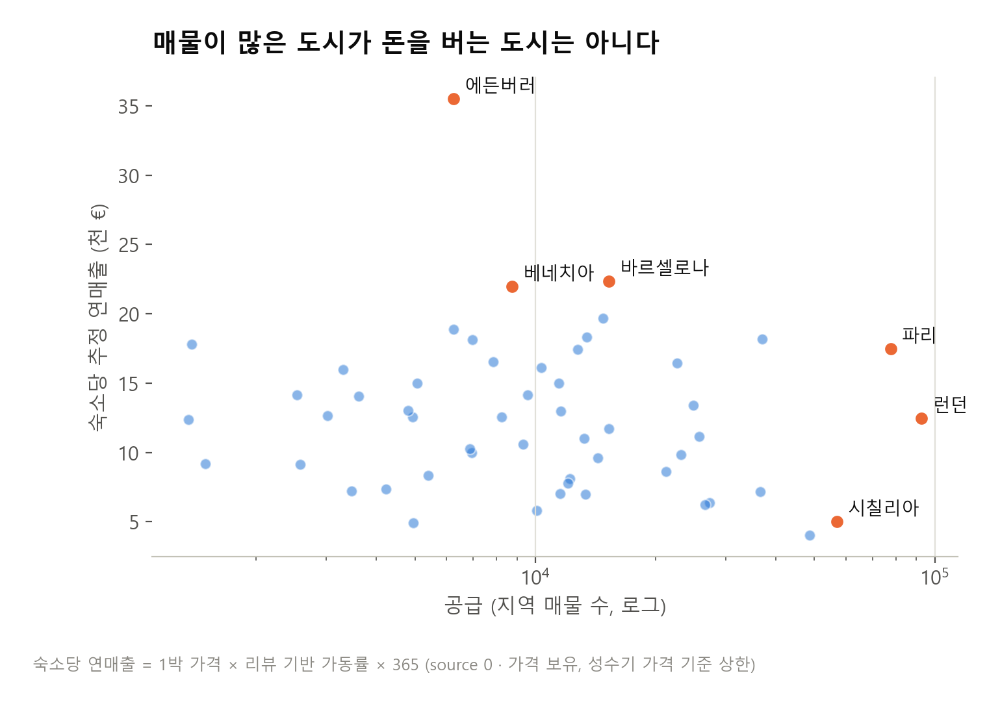

| 도시 | 공급 순위 | 1박 가격 | 리뷰 기반 가동률 | 숙소당 연매출 | 수익 순위 |
| --- | ---: | ---: | ---: | ---: | ---: |
| **에든버러** | 38위 | 268€ | 32.3% | 35,515€ | **1위** |
| 바르셀로나 | 14위 | 181€ | 26.1% | 22,350€ | 2위 |
| **런던** | **1위** | 212€ | 13.2% | 12,451€ | **27위** |
| **시칠리아** | **3위** | 128€ | 8.5% | 5,020€ | **51위** |

→ 공급이 몰린 곳과 돈이 되는 곳이 다름. 금액은 성수기 가격 기준 상한이라 **순위 비교**로만 사용
</aside>

<aside>

### ③ 공급은 병목이 아니다

| 첫 리뷰 연도 | 2020 | 2022 | 2023 | 2024 | 2025 |
| --- | ---: | ---: | ---: | ---: | ---: |
| 신규 매물 | 20,812 | 65,487 | 87,997 | 107,801 | **122,638** |

→ 신규 공급은 매년 늘고 있음. **문제는 숙소가 모자란 것이 아니라, 들어온 숙소가 팔리지 않는 것**
</aside>

---

## 2-2. 분석 대상: `source == 0`만 쓴다

<aside>

### ① `source == 1`은 과거 값이 이월된 행

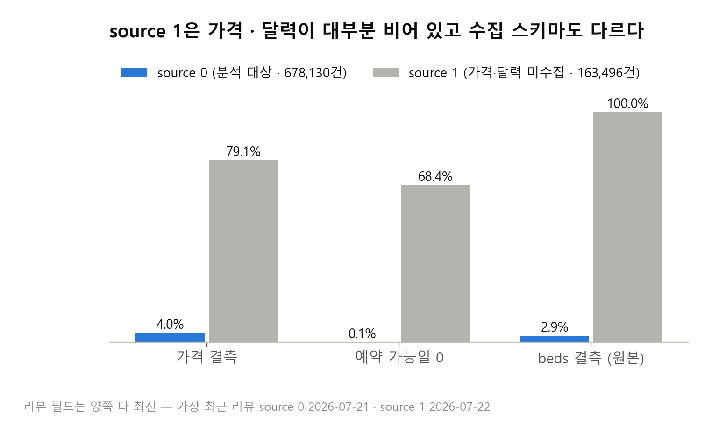

| | `source == 0` | `source == 1` | 이월로 설명하면 |
| --- | ---: | ---: | --- |
| 행 수 | 678,130 (80.6%) | 163,496 (19.4%) | |
| `price` 결측 | 4.0% | **79.1%** | 가격은 실시간 견적이라 이월 불가 |
| `beds` · `bathrooms` 결측 (원본) | 2.9% · 7.0% | **100% · 100%** | 과거 스냅샷에 필드 자체가 없음 |
| 예약 가능일 0 | 0.07% | **68.4%** | 달력을 못 가져와 0으로 채워짐 |
| 마지막 리뷰 중앙값 | 2026-05-25 | **2024-09-27** | 값의 시점이 약 20개월 전 |
</aside>

<aside>

### ② 같은 호스트로 비교하면 결정적

양쪽에 모두 매물이 있는 **호스트 15,871명**의 매물만 비교

| 같은 호스트의 매물 | `source == 0` | `source == 1` |
| --- | ---: | ---: |
| 예약 가능일 0 | **0.1%** | **50.4%** |
| 가격 결측 | 9.9% | 66.7% |
| 누적 리뷰 0건 | 22.4% | 25.1% |

→ 같은 사람이 운영하는데 달력만 50%p 차이 = **운영 차이가 아니라 정보 부재**
</aside>

<aside>

### ③ 섞으면 생기는 일

**ⅰ. 같은 0이 정반대 의미**

- `source == 0`의 예약 가능일 0은 452건뿐이고 66%가 최근 리뷰 보유 = **꽉 차서 0**
- `source == 1`의 0 = **못 가져와서 0** (예약 가능일 0의 99.6%가 `source == 1`)

**ⅱ. 도시 비교 왜곡**

- `source == 1` 비중: 아테네 0% ~ 베를린 48%
- 섞으면 "베를린은 안 팔린다"가 **갱신 실패율 차이**로 만들어짐

- 예상 반론
    - **19.4%를 버리면 편향 아닌가?** → "현재를 묻는 질문"에서만 뺌. `source == 0`만으로도 53개 지역이 모두 남음
    - **이탈한 매물이면 그 자체가 문제 아닌가?** → 그럴 수 있지만 가격 · 달력 · 최근 리뷰가 없어 원인을 진단할 수 없음
    - **수집 채널 차이 아닌가?** → 같은 호스트 안에서도 달력이 50%p 다르고 필드 자체가 없음
</aside>

---

## 2-3. 활동성 지표: 최근 1년 리뷰 수

<aside>
🚨

숙소가 **지금 팔리고 있는지**는 **최근 1년 리뷰 수**(`number_of_reviews_ltm`)로 판단했습니다.

</aside>

<aside>

### ① 출발점: 예약 · 매출 데이터의 부재

- 데이터에 **예약 건수와 매출 컬럼이 없음**
- 숙소가 팔렸는지 알 수 있는 흔적은 두 가지뿐
    - **리뷰**: 손님이 묵고 남긴 기록
    - **달력**: 앞으로 예약할 수 있는 날짜 수
- 이 두 계열에서 "지금 팔리고 있는가"를 가장 정직하게 보여주는 지표를 골라야 함
</aside>

<aside>

### ② 지표 선정 기준과 후보 비교

**ⅰ. 세 가지 기준**

- **지금의 상태인가** — 몇 년 전 거래가 섞이면 안 됨
- **실제 거래인가** — 호스트 설정이 아니라 손님이 묵은 흔적이어야 함
- **빈 값이 없는가** — 추정 · 대체 없이 모든 숙소에 쓸 수 있어야 함

**ⅱ. 후보 비교**

| 후보 | 지금의 상태 | 실제 거래 | 빈 값 없음 | 한 줄 평가 |
| --- | :---: | :---: | :---: | --- |
| `number_of_reviews_ltm` | O | O | O | 세 기준을 모두 만족 → 선택 |
| `number_of_reviews` | X | O | O | 몇 년 전 거래까지 섞임 |
| `reviews_per_month` | X | O | X (결측 18.5%) | 첫 리뷰 이후 평생 평균 |
| `availability_30/60/90/365` | O | X | O | 가동률(1 − 빈 날 ÷ N)로 쓰면 호스트가 막아 둔 날도 예약으로 셈 |
| `review_scores_rating` | X | X | X (결측 18.5%) | 거래가 아니라 만족도, 대부분 4.8 이상 |

- 상세 — 나머지 리뷰 컬럼
    - `number_of_reviews_ly` (지난 1년): `ltm`과 기간이 겹침 — 39.8%가 완전히 같고, `ltm + ly > 누적`인 행 19.7% → 전년 대비 비교에도 못 씀
    - `number_of_reviews_l30d` (최근 30일): 수집 시점이 여름이라 계절성이 그대로 들어감 → 지역 계절성 지수에만 사용
    - 월평균 리뷰 = 누적 리뷰 ÷ 첫 리뷰 이후 개월 수 (실측 상관 0.991)
</aside>

<aside>

### ③ 탈락 사례: 누적 리뷰와 달력 가동률

**ⅰ. 누적 리뷰 — 오래전에 멈춘 숙소가 '활동 중'으로 보임**

> 최근 1년 동안 한 번도 안 팔린 숙소 중 **39%(80,918건)**는 누적 리뷰가 있습니다.
> 이 숙소들의 마지막 리뷰는 **중앙값 약 2년 전**입니다.

→ 누적 리뷰로 보면 2년 전에 멈춘 숙소도 "리뷰 있는 숙소"가 됨

**ⅱ. 달력 가동률 — 꽉 찬 것처럼 보이는 숙소의 절반이 안 팔림**

> 앞으로 90일이 **전부 닫힌** 숙소 25,301건 중 **54%는 1년 동안 한 건도 안 팔렸습니다.**

→ 만실이 아니라 호스트가 막아 둔 달력

- 상세 — 달력 가동률 추가 검증
    - 팔리는 숙소 안에서 달력 가동률과 최근 1년 리뷰 수의 순위상관 **0.003** (관계 없음)
    - 지역 순위를 매기면 리뷰 기반 가동률과 **반대 방향** (순위상관 −0.25)
    - 최소 숙박 4–7박: 달력 가동률은 54%로 가장 높은데, 1년 무거래율은 2박의 2배
</aside>

---

## 2-4. 최소 숙박 4박부터 판매가 꺾인다

<aside>

### ① 원자료

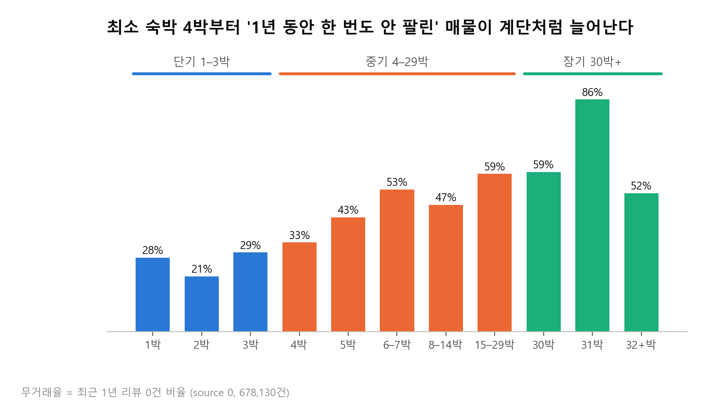

| 최소 숙박 | 1 | 2 | 3 | **4** | **5** | **6–7** | 8–14 | 15–29 | 30 | **31** | 32+ |
| --- | ---: | ---: | ---: | ---: | ---: | ---: | ---: | ---: | ---: | ---: | ---: |
| 무거래율 | 28% | **21%** | 29% | **33%** | **43%** | **53%** | 47% | 59% | 59% | **86%** | 52% |
| 매물 | 313,768 | 171,809 | 77,968 | 25,845 | 20,004 | 19,251 | 5,977 | 5,585 | 12,607 | 22,481 | 2,835 |

→ 1–3박은 21–30%로 평평, **4박부터 계단처럼** 오름
</aside>

# 3. 세그먼트

## 3-1. 축 설정

<aside>

### ① 세로축: 최근 1년 리뷰 O / X

| 최근 1년 리뷰 | 의미 | `source == 0` 중 |
| --- | --- | ---: |
| 1건 이상 | O — 팔림 | 471,755건 (69.6%) |
| 0건 | X — 안 팔림 | 206,375건 (30.4%) |

- 플랫폼 수수료는 거래가 있어야 생김 → 0건과 1건의 경계 = 돈을 버는가의 경계
- 지표 선정 근거는 2-3
</aside>

<aside>

### ② 가로축: 최소 숙박 단기 · 중기 · 장기

| 최소 숙박 | 의미 | `source == 0` 중 |
| --- | --- | ---: |
| 1–3박 | 단기 | 563,545건 (83.1%) |
| 4–29박 | 중기 | 76,662건 (11.3%) |
| 30박 이상 | 장기 | 37,923건 (5.6%) |

- 4박: 판매가 꺾이는 지점 (2-4)
- 30박: 단기 숙박과 월 단위 임대의 관행적 경계
</aside>

<aside>

### ③ 축에서 뺀 것

| 컬럼 | 뺀 이유 |
| --- | --- |
| `maximum_nights` | 6칸 모두 중앙값 365일, 32.6%가 플랫폼 기본값(1,125일) |
| `availability_365` | `source == 0`에서 0인 매물 0.07% — 나눌 대상이 없음 |
| 평점 | 6칸 중앙값 4.80–4.91로 붙어 있음 |
</aside>

---

## 3-2. 2×3 세그먼트

<aside>

### ① 6칸

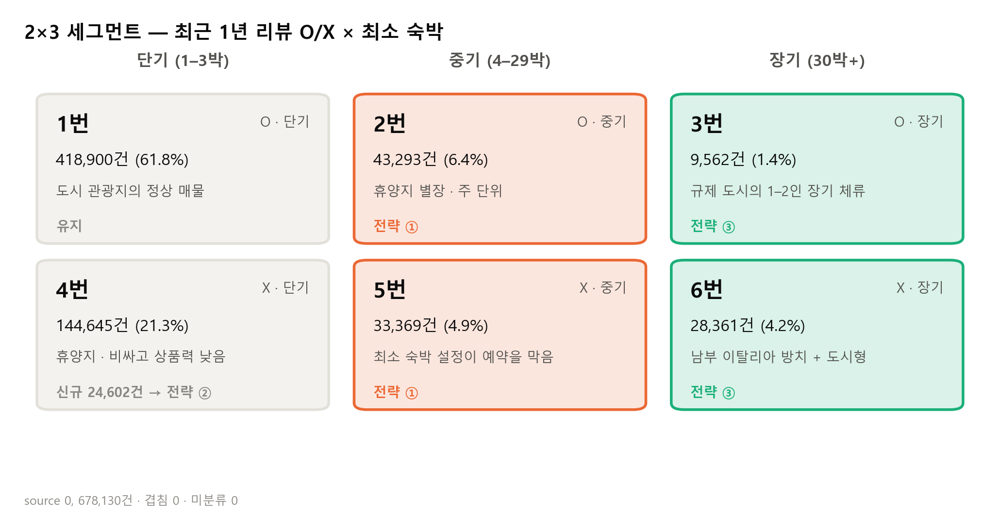

| | **단기** (1–3박) | **중기** (4–29박) | **장기** (30박+) |
| --- | --- | --- | --- |
| **리뷰 O** | **1번** 418,900 (61.8%) | **2번** 43,293 (6.4%) | **3번** 9,562 (1.4%) |
| **리뷰 X** | **4번** 144,645 (21.3%) | **5번** 33,369 (4.9%) | **6번** 28,361 (4.2%) |

`source == 0` 678,130건 · 겹침 0 · 미분류 0

- 상세 — 6칸 특징 비교표
    
    | 지표 | 1번 | 2번 | 3번 | 4번 | 5번 | 6번 |
    | --- | ---: | ---: | ---: | ---: | ---: | ---: |
    | 1박 가격 중앙값 | 153€ | 177€ | 76€ | 167€ | 206€ | 92€ |
    | 동급 대비 가격 | 1.00배 | 0.93배 | 0.53배 | **1.13배** | 1.01배 | 0.68배 |
    | 동급 대비 편의시설 | +2 | +3 | +1 | **−6** | **−6** | **−9** |
    | 수용 인원 | 4명 | 4명 | **2명** | 4명 | 4명 | 3명 |
    | 통집 비율 | 84.1% | **91.6%** | 85.1% | 71.5% | 89.1% | 74.7% |
    | 할인 적용 | 6.2% | 17.3% | **53.9%** | 14.4% | 23.3% | 51.5% |
    | 예약 가능일 | 223일 | **181일** | 247일 | 261일 | 216일 | **316일** |
    | 최근 1년 리뷰 중앙값 | **9건** | 4건 | 2건 | 0 | 0 | 0 |
    | 슈퍼호스트 | **41.0%** | 34.6% | 36.3% | 11.6% | 11.8% | **7.2%** |
    | 호스트 경력 1년 미만 | 8.5% | 4.1% | 4.2% | **17.0%** | 11.1% | 4.1% |
</aside>

<aside>

### ② 칸 차이는 우연인가

| 검정 | 효과 크기 | 판정 |
| --- | ---: | --- |
| 리뷰 O/X × 최소 숙박 (카이제곱) | Cramér V **0.265** | 중간 — 두 축이 독립이 아님 |
| 6칸 × 슈퍼호스트 | V 0.294 | 중간 |
| 6칸 × 편의시설 (Kruskal-Wallis) | ε² 0.082 | 중간 |
| 6칸 × 동급 대비 가격 | ε² 0.059 | 작음~중간 |

**두 축을 함께 봐야 하는 이유**

최소 숙박이 길수록 무거래가 많음 (단기 26% → 중기 44% → 장기 75%). 한 축만 보면 다른 축의 효과가 섞임

- 상세 — p값 대신 효과 크기를 본 이유
    - 표본이 67만 건이라 아주 작은 차이도 p값이 0에 가깝게 나옴. "얼마나 큰가"는 효과 크기로 판단
</aside>

---

## 3-3. 칸별 결과 해석

<aside>

### ① 1번 (O · 단기) — 도시 관광지의 정상 매물

- 6칸 중 가장 잘 팔림 (최근 1년 리뷰 중앙값 9건), 슈퍼호스트 41%로 최고
- 부다페스트 · 세비야 · 베네치아는 지역 매물의 80% 이상이 1번
- → **기준 집단, 유지**
</aside>

<aside>

### ② 2번 (O · 중기) — 휴양지 별장, 주 단위 렌탈

- 통집 91.6%, 침실 2개, 4–5박이 66%, 경력 7년 · 1채 개인 호스트가 많음
- 발렌시아 · 메노르카 · 마요르카 등 휴양지
- "럭셔리"는 착시: 칸 전체로는 177€로 비싸 보이지만 동급 안에서는 **0.90배**
- → **팔리지만 끊길 위험이 2배** (4-5) — **전략 ①**
</aside>

<aside>

### ③ 3번 (O · 장기) — 규제 도시의 1–2인 장기 체류

- 수용 인원 2명, 월 단위 할인 53.9%, 21채+ 사업자 비중 최고
- 바르셀로나는 지역 매물의 16.8%가 3번 (전체 평균 1.4%의 약 12배)
- → **규제 안에서 수수료를 만드는 경로** — **전략 ③**
</aside>

<aside>

### ④ 4번 (X · 단기) — 휴양지에서 비싸고 상품력 낮음

- 동급보다 13% 비싸고 편의시설 6개 적음, 슈퍼호스트 11.6%
- 풀리아 · 남에게해 · 시칠리아 등 여름 휴양지 (계절성과 무거래율 순위상관 0.51)
- 개설 후 한 번도 안 팔린 매물 61%, **신규 매물 24,602건**
- → 신규 매물은 **전략 ②**
</aside>

<aside>

### ⑤ 5번 (X · 중기) — 최소 숙박 설정이 예약을 막음

- 집 자체(침실 · 통집)는 2번과 비슷한데 편의시설 −6, 슈퍼호스트 11.8%
- 2번보다 최소 숙박을 더 길게 걺 (6박 이상 49%)
- → **전략 ①** (4장)
</aside>

<aside>

### ⑥ 6번 (X · 장기) — 남부 이탈리아 방치 재고 + 도시형 경쟁력 부족

- 편의시설 −9개, 슈퍼호스트 7.2%, 달력은 316일 열려 있음
- 41%가 남부 이탈리아 휴양지 — 가격 · 편의시설이 같아도 무거래 오즈 **14배** (장기 수요 자체가 없음)
- 나머지 도시형은 같은 도시의 3번보다 편의시설이 8개 적음
- → **전략 ③**
</aside>

---

## 3-4. 전략 대상 선정

<aside>

### ① 칸 → 전략

| 전략 | 대상 | 규모 | 처방 방향 |
| --- | --- | ---: | --- |
| **① 중기 매물 최소 숙박 하향** | 2 · 5번 | 76,662 | 최소 숙박을 3박 이하로 |
| **② 신규 매물 처방** | `new_listing` (주로 4번) | 29,487 | 첫 예약 전환 (팀원) |
| **③ 장기 숙소 타겟팅** | 3 · 6번 | 37,923 | 장기 체류 수요 겨냥 (팀원) |
| 유지 | 1번 | 418,900 | — |
</aside>

<aside>

### ② 왜 이 셋인가

**칸마다 막힌 이유가 다르다**

- 중기 매물은 **설정**이, 신규 매물은 **첫 예약 경험**이, 장기 매물은 **수요의 위치**가 문제
- 모든 안 팔리는 숙소에 "가격을 낮추라"고 일괄 안내하면 객단가를 깎아 수수료도 함께 줄어듦

</aside>

# 4. 전략 ① 중기 매물 최소 숙박 하향 (2 · 5번)

## 4-1. 넘어야 할 반론

<aside>

### ① 반론 네 개

| # | 반론 | 답한 곳 |
| --- | --- | --- |
| 1 | 중기 매물이 많은 동네 · 집 유형이 원래 안 팔리는 것 아닌가? | 4-2 |
| 2 | 비싸거나 편의시설이 부족해서 아닌가? | 4-2 · 4-4 |
| 3 | 의지 약한 호스트가 최소 숙박도 길게 거는 것 아닌가? (역인과) | 4-3 |
| 4 | 2번은 지금 잘 팔리는데 왜 건드리나? | 4-5 |
</aside>

---

## 4-2. 같은 조건에서도 덜 팔리는가

<aside>

### ① 동급 그룹 비교 (부호 검정)

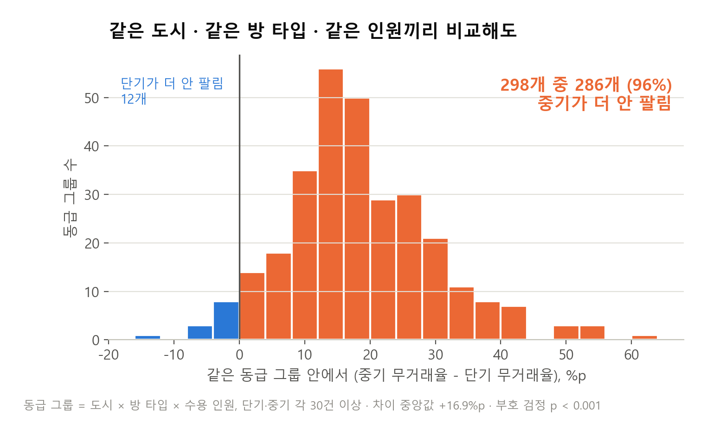

- 같은 도시 · 방 타입 · 인원 그룹 중 단기 · 중기가 각 30건 이상인 그룹 298개
- 그룹마다 "중기가 단기보다 더 안 팔리나?"를 확인 = **작은 비교 실험 298번**
- **286개(96%)**에서 중기가 더 안 팔림, 차이 중앙값 **+16.9%p**
- 차이가 없다면 반반쯤 나와야 함 → 부호 검정 p < 0.001
</aside>

<aside>

### ② 로지스틱 회귀 — 가격 · 편의시설 · 지역을 맞춰도

**대상** 1·2·4·5번 · 신규 매물 제외 · 동급 비교 가능 · 슈퍼호스트 확인됨 → **585,601건** (무거래 23.6%)
**목표 변수** 최근 1년 리뷰 0건 = 1

| 변수 | 계수 | 오즈비 | 95% 신뢰구간 | 표준화 계수 |
| --- | ---: | ---: | --- | ---: |
| **중기 설정 (4–29박)** | 0.967 | **2.63** | 2.58 – 2.68 | **+0.31** |
| 동급 대비 가격 (log) | 0.892 | 2.44 | 2.41 – 2.47 | +0.44 |
| 동급 대비 편의시설 (+5개) | −0.142 | 0.868 | 0.865 – 0.870 | −0.41 |
| 통집 | −0.841 | 0.431 | 0.424 – 0.438 | −0.32 |
| 지역 계절성 지수 (+0.1) | 0.120 | 1.13 | 1.12 – 1.13 | +0.27 |
| 슈퍼호스트 *(통제)* | −1.278 | 0.278 | 0.274 – 0.283 | −0.61 |

- 평범한 매물(무거래 24%)에서 오즈비 2.63 → **약 45%**
- 학습에 안 쓴 도시에서 시험해도 AUC **0.754**
- 지역 더미 53개를 넣어도 중기 오즈비 **2.80**

**슈퍼호스트는 통제 변수로만**

실적이 있어야 받는 자격이라 "슈퍼호스트라서 팔린다"인지 "팔려서 슈퍼호스트가 됐다"인지 구분 불가 → 해석하지 않음

</aside>

<aside>

### ③ 용량-반응 — 하루 늘릴 때마다

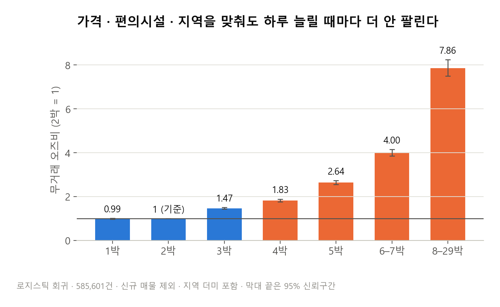

| 최소 숙박 | 1박 | 2박 | 3박 | 4박 | 5박 | 6–7박 | 8–29박 |
| --- | ---: | ---: | ---: | ---: | ---: | ---: | ---: |
| 오즈비 (2박 = 1) | 0.995 | 1 | 1.47 | **1.83** | **2.64** | **4.00** | **7.86** |

→ 신뢰구간이 겹치지 않고 단조롭게 커짐. "많이 걸수록 더 나빠지는" 계단 모양은 우연보다 실제 관계에 가깝다는 신호
</aside>

<aside>

### ④ 중기가 관행인 지역이라면?

- 거래 매물의 20% 이상이 중기인 지역(발렌시아 · 마요르카 · 메노르카 등)만 봐도
- 무거래율 **중기 34% vs 단기 23%** (+11%p)
- 지역별로 따로 봐도 중기가 더 안 팔리는 지역 **53 / 53**
</aside>

---

## 4-3. 호스트 탓은 아닌가

<aside>

### ① 같은 호스트의 매물끼리 비교

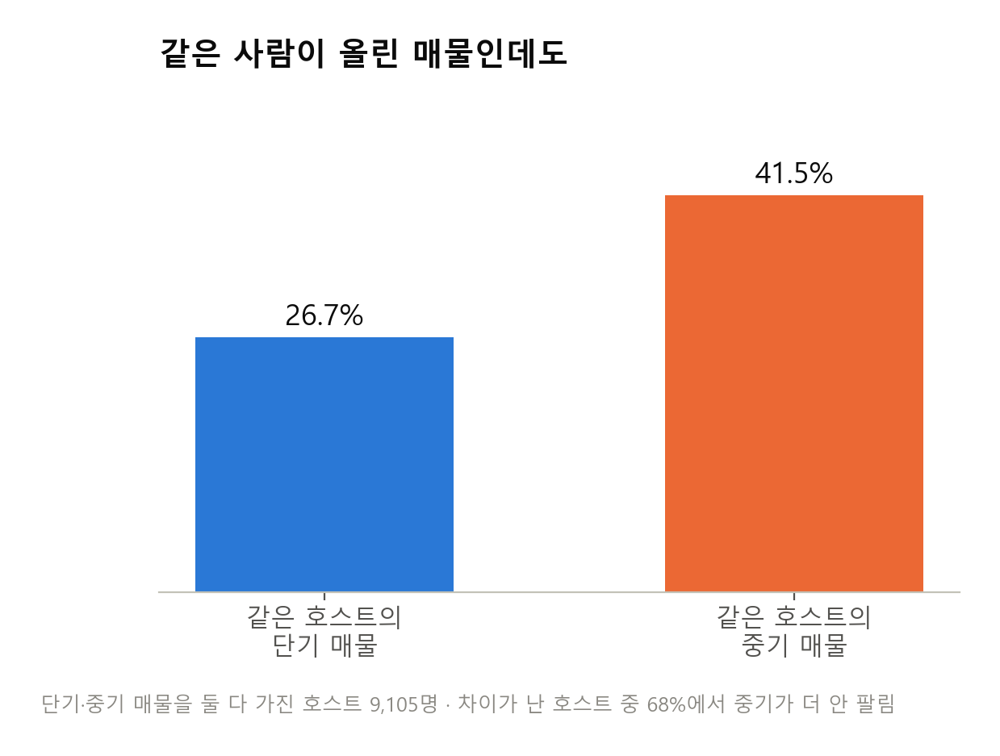

"의지 약한 호스트가 최소 숙박도 길게 건다"가 맞다면, **같은 호스트의 매물끼리** 비교했을 때 차이가 사라져야 함. 같은 사람 안에서는 의지 · 역량 · 운영 방식이 같기 때문

- 단기 · 중기 매물을 **둘 다 가진 호스트 9,105명** (매물 77,094건)
- 호스트 평균 무거래율: 단기 매물 **26.7%** vs 중기 매물 **41.5%**
- 차이가 난 호스트 4,539명 중 **3,094명(68%)**에서 중기가 더 안 팔림 (부호 검정 p < 0.001)
- **2채만 가진 개인 호스트**(3,700명)에서도 72%
</aside>

<aside>

### ② 호스트 더미를 넣은 선형회귀

$$
\text{무거래} = b \times \text{중기} + c \times \text{가격} + d \times \text{편의시설} + e \times \text{통집} + (\text{호스트 A 더미}) + (\text{호스트 B 더미}) + \cdots
$$

**ⅰ. 원리**

- 호스트 더미 8,951개가 "원래 잘 파는 사람인가"를 흡수 → 남은 `b`는 **같은 호스트 안에서의 차이**만 뜻함
- 결과가 0/1이라 `b`는 바로 **확률 차이(%p)**

**ⅱ. 결과** (신규 매물 제외)

| 비교 범위 | 매물 | 중기 설정 효과 | 95% 신뢰구간 |
| --- | ---: | ---: | --- |
| 같은 호스트 안 | 73,078 (호스트 8,951명) | **+14.1%p** (단기 27.3% 기준) | 13.0 – 15.2 |
| 같은 호스트 · 같은 동급 그룹 안 | 73,078 (묶음 23,769개) | **+13.0%p** | 11.9 – 14.2 |

- 상세 — 계산 방식
    - 더미 8,951개를 실제로 넣는 대신, 각 매물 값에서 그 호스트의 평균을 빼고 회귀 (수학적으로 같은 결과)
    - 신뢰구간은 같은 호스트의 매물을 한 덩어리로 보고 계산 (군집 강건 표준오차 — 일반 방식보다 보수적)
</aside>

<aside>

### ③ 같은 호스트 안 용량-반응

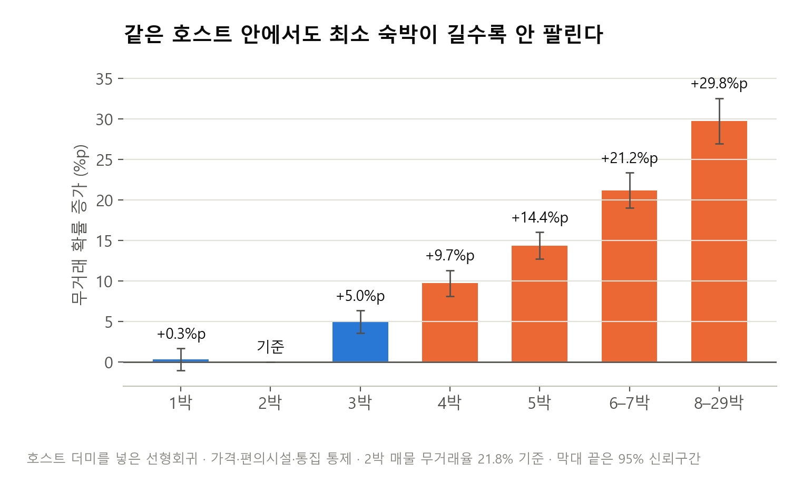

| 최소 숙박 | 1박 | 2박 | 3박 | 4박 | 5박 | 6–7박 | 8–29박 |
| --- | ---: | ---: | ---: | ---: | ---: | ---: | ---: |
| 무거래 확률 증가 | +0.3%p | 0 | +5.0%p | +9.7%p | +14.4%p | +21.2%p | **+29.8%p** |

→ 같은 사람의 매물끼리 비교해도 차이가 남고, 계단 모양도 그대로 → 차이는 호스트가 아니라 **숙소 설정**에 붙어 있음
</aside>

---

## 4-4. 편의시설을 채우면 되지 않나

<aside>

### ① 편의시설 × 중기 상호작용

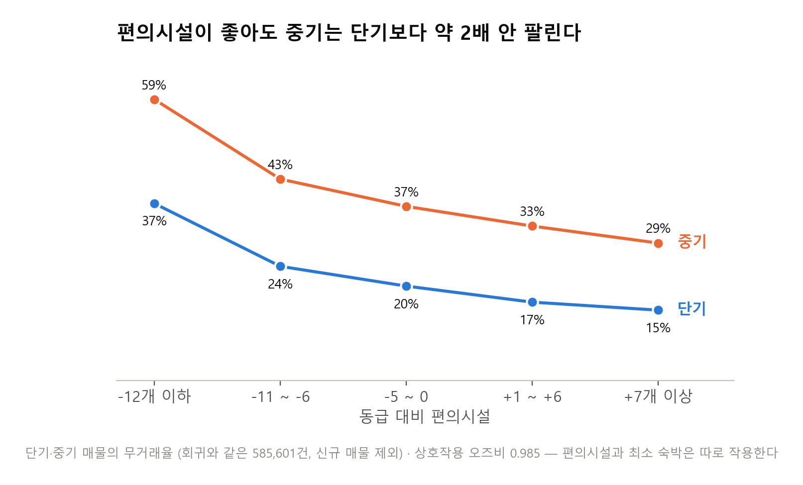

| 동급 대비 편의시설 | −12개 이하 | −11 ~ −6 | −5 ~ 0 | +1 ~ +6 | +7개 이상 |
| --- | ---: | ---: | ---: | ---: | ---: |
| 단기 무거래율 | 37% | 24% | 20% | 17% | 15% |
| 중기 무거래율 | 59% | 43% | 37% | 33% | 29% |
| 중기 ÷ 단기 | 1.6배 | 1.8배 | 1.8배 | 2.0배 | 2.0배 |

- 상호작용 오즈비 0.985 (95% 신뢰구간 0.979 – 0.991) — 크기는 사실상 없음
- 편의시설이 동급보다 7개 이상 많아도 **중기는 단기보다 약 2배** 안 팔림
- → 편의시설과 최소 숙박은 **각자 따로** 작용. 최소 숙박 하향은 편의시설 보완과 **별개로** 필요
</aside>

---

## 4-5. 2번은 팔리는데 왜 줄이나

<aside>

### ① 매출 손해는 단정할 수 없다

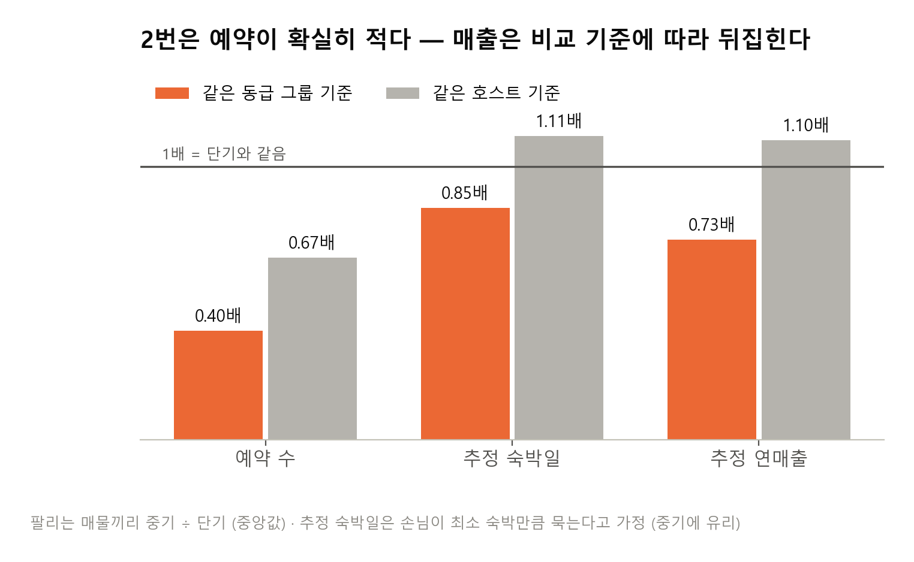

| 팔리는 매물끼리 중기 ÷ 단기 | 같은 동급 그룹 (285개) | 같은 호스트 (5,378명) |
| --- | ---: | ---: |
| 예약 수 (최근 1년 리뷰) | **0.40배** (94%에서 중기가 적음) | **0.67배** |
| 추정 숙박일 | 0.85배 | 1.11배 |
| 추정 연매출 | 0.73배 | 1.10배 |

- 예약은 확실히 적지만, 한 번에 길게 묵어서 매출은 비교 기준에 따라 뒤집힘
- → **"2번은 지금 손해를 보고 있다"고는 말하지 않음**
</aside>

<aside>

### ② 대신 끊김 위험이 2배

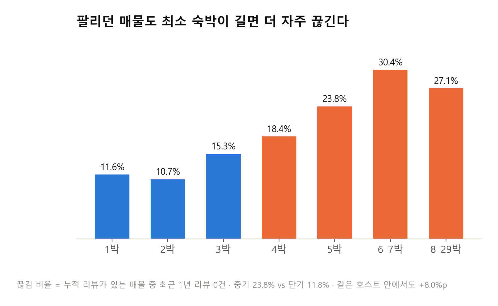

**끊김 비율** = 과거에 한 번이라도 팔린 매물 중 최근 1년 거래가 끊긴 비율

| 비교 | 결과 |
| --- | --- |
| 원자료 | 중기 **23.8%** vs 단기 11.8% (2배) |
| 같은 동급 그룹 | 268개 중 **258개(96%)**에서 중기가 더 많이 끊김 (+11.6%p) |
| 동급 그룹 더미 회귀 | **+12.7%p** |
| 같은 호스트 더미 회귀 | **+8.0%p** (단기 11.3% 기준 → 약 1.7배) |

→ **2번은 5번으로 넘어가는 길목**

- 상세 — 한계
    - 한 시점 데이터라 "끊긴 뒤에 최소 숙박을 늘렸다"는 순서를 완전히 배제할 수는 없음
    - 끊김 비율은 1년 단위가 아니라 매물 생애 동안의 누적 비율
</aside>

<aside>

### ③ 최소 숙박은 하한일 뿐

| | 1번 | 2번 |
| --- | ---: | ---: |
| 예약 가능일 (365일 중) | 223일 | **181일** |
| 최근 1년 리뷰 중앙값 | 9건 | **4건** |

- 2번은 달력을 181일 열어 두고도 예약이 1번의 절반 이하
- 최소 숙박을 3박으로 낮춰도 **7박 손님은 그대로 7박 예약** 가능
- 단, 성수기에는 짧은 예약이 한 주를 쪼개 7박 예약을 막을 수 있음 → **비수기와 예약 사이 빈 날짜만** 낮추도록 권함
- 예약 사이에 3박이 남았는데 최소 숙박이 4박이면 그 3박은 **지금 아예 팔 수 없는 날**
</aside>

---

## 4-6. 처방

<aside>

### ① 5번 — 3박 이하로 하향

- 메시지: "최소 숙박을 **3박 이하**로 낮추세요" (2박이 가장 유리)
- 근거로 보여줄 것: 같은 조건 매물 중 3박 이하의 무거래율, 하루 늘릴 때마다의 무거래 확률 증가분
- 편의시설 부족분도 함께 (편의시설이 좋아도 중기는 2배 덜 팔림 → 둘 다 고쳐야 함)
</aside>

<aside>

### ② 2번 — 비수기 · 빈 날짜에 3박 이하 허용

- 메시지: "성수기 주 단위는 그대로, **비수기와 예약 사이 빈 날짜**에 3박 이하를 허용하세요"
- 근거로 보여줄 것: 같은 조건 단기 매물의 예약 수(2.5배), 끊김 비율
- 4박 → 3박부터
</aside>

<aside>

### ③ 이 레버인 이유

**ⅰ. 비용이 거의 없음** — 설정값 하나. 편의시설 구매나 가격 인하와 다름

**ⅱ. 본사가 바로 실행** — 호스트 알림 · 설정 화면 안내. 규제와 무관 (30박+ 규제 도시 매물은 대상 아님)

**ⅲ. 객단가를 깎지 않음** — 가격을 건드리지 않고 판매 빈도를 올려 수수료와 바로 연결

- 상세 — 말해도 되는 것과 안 되는 것
    
    | 말해도 된다 | 말하면 안 된다 |
    | --- | --- |
    | 같은 호스트의 매물끼리 비교해도 최소 숙박이 긴 매물이 덜 팔린다 | 최소 숙박을 낮추면 팔린다 (인과) |
    | 하루 늘릴 때마다 계단처럼 나빠진다 | 2번은 지금 매출 손해를 보고 있다 |
    | 2번은 같은 조건 단기 매물보다 끊길 위험이 2배 | "중기는 상품이 받쳐 주면 괜찮다" (기각됨) |
</aside>

# 5. 전략 ② 신규 매물 처방

<aside>

(팀원 작성) — 대상 `new_listing` **29,487건** (4번 24,602 · 5번 3,710 · 6번 1,175)

- 5번의 신규 매물 3,710건은 전략 ①과 겹침
</aside>

# 6. 전략 ③ 장기 숙소 타겟팅

<aside>

(팀원 작성) — 대상 장기 매물 **37,923건** (3번 9,562 · 6번 28,361)

- 참고: 3-3 ③ · ⑥, `reports/SEGMENTATION_2x3.md` 3 · 6번 카드
</aside>

# 7. 기대효과

## 7-1. 계산 방식

<aside>

$$
\text{연 수수료} = \text{1박 가격} \times \text{리뷰 기반 가동률} \times 365 \times 0.85 \times 15.5\%
$$

- **0.85 = 비성수기 보정** — 가격 견적의 90%가 6–8월이라 `price`는 성수기 가격. 비성수기 견적은 동급 대비 0.85배
- 연관을 인과처럼 적용한 **상한에 가까운 추정** → 범위로만 제시
</aside>

## 7-2. 전략 ①

<aside>

### ① 5번 — 새로 팔리기 시작하는 매물

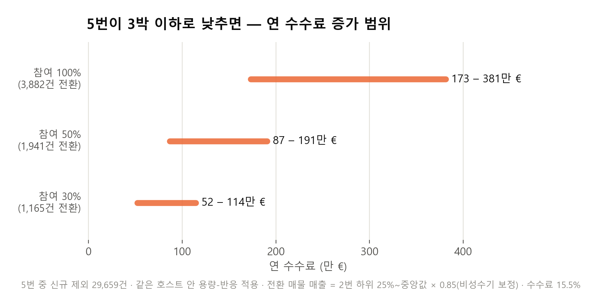

- 대상: 5번 중 신규 매물 제외 **29,659건**
- 같은 호스트 안 용량-반응을 적용 — 예: 6–7박 → 3박이면 무거래 확률 21.2 − 5.0 = **16.2%p 감소**
- 평균 판매 확률 +13.1%p → 전원 참여 시 **약 3,880건이 새로 팔림**

| 호스트 참여율 | 새로 팔리는 매물 | 연 수수료 (전환 매물 매출 = 2번 하위 25% ~ 중앙값) |
| --- | ---: | ---: |
| 30% | 약 1,160건 | 약 52만 – 114만 € |
| 50% | 약 1,940건 | 약 87만 – 191만 € |
| 100% | 약 3,880건 | 약 173만 – 381만 € |
</aside>

<aside>

### ② 2번 — 끊기지 않게 지키는 수수료

- 2번의 연 수수료 합계(보정 후) 약 **7,300만 €**
- 같은 호스트 안 끊김 위험 차이 **8.0%p** → 약 **175만 € (참여 30%) – 585만 € (전원)**
- 매년 지키는 금액이 아니라 **위험에 노출된 규모**로 읽음
</aside>

## 7-3. 전략 ② · ③

<aside>

(팀원 작성) — 같은 수식과 같은 보정(0.85)을 써서 범위로

</aside>

# ☑️ 결론 및 전체 흐름 시각화

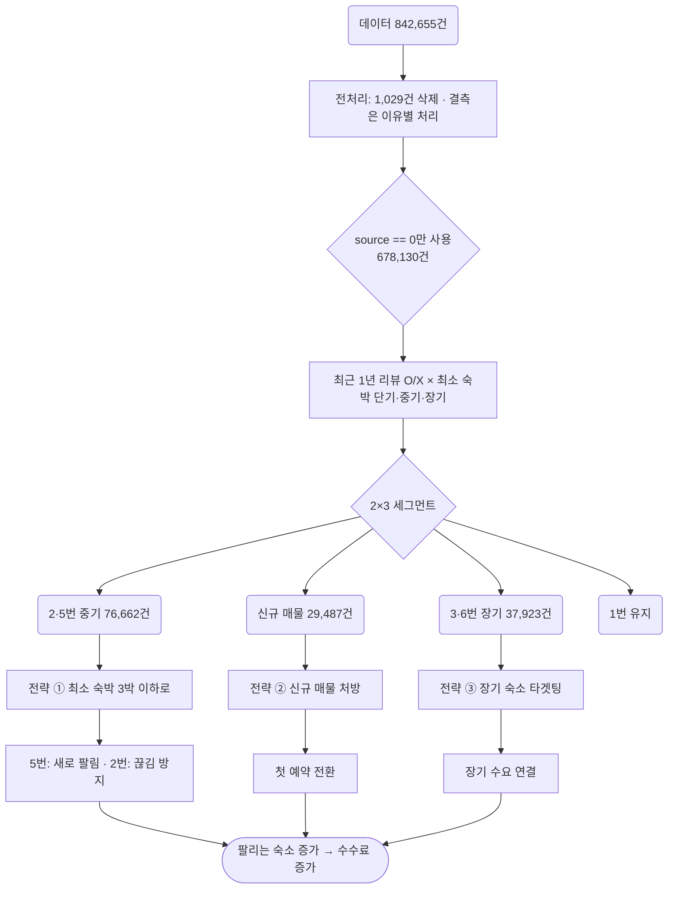

# 8. 부록

(분석했지만 본문에 쓰지 않은 것들)

- 데이터 수집 시점 — 지역마다 2026-06-15 ~ 07-21
    - 각 지역의 마지막 리뷰 최댓값 ≈ 그 지역의 첫 가격 견적 체크인 날짜 → 이 날을 그 지역의 수집일로 봄
        - 예: 암스테르담 06-15 / 06-16, 비엔나 06-20 / 06-20, 바르셀로나 06-25 / 06-24
        - 마지막 리뷰가 견적 체크인보다 늦은 행 **0건** (수집 당일 이후 리뷰는 없고, 견적은 수집일부터 잡힘)
    - 53개 지역 중 **51개가 06-15 ~ 07-06**에 수집
    - 최근 1년 리뷰 등은 **각 지역의 수집일 기준** 값 → 비교는 가능하면 같은 지역 안(동급 그룹)에서
    - 마지막 리뷰 경과일은 전체 최댓값 **2026-07-22**로 통일해 계산 → 일찍 수집된 지역은 최대 약 5주 길게 잡힘
- 이전 판 — 5층 공급 분류 (L1–L5)
    - 2×3 이전에는 전체 841,626건을 5층으로 나눔 (L1 상태 미확인 · L2 장기 설정 · L3 단기 무거래 · L4 저활동 · L5 안정 거래)
    - L1의 99.8%가 `source == 1`이라 `source == 0`으로 한정하면서 사라짐
    - L3를 최소 숙박으로 쪼갠 것이 4번 + 5번 → **"최소 숙박 설정 문제"를 별도 칸(5번)으로 꺼낸 것이 2×3의 핵심 개선**
    - 기록: `reports/SEGMENTATION.md` · `MODELING_RESULTS.md`
- 4 · 5번 진단 알림안 (전략 재편 이전)
    - 결정 트리가 찾은 기준선: 편의시설 동급 대비 −12개 · 가격 1.7배 · 최소 숙박 4.5박
    - 4 · 5번 중 기준선에 하나라도 걸리는 매물 93,525건 (`alert_target`)
    - 기록: `reports/TARGET_4_5.md`
- 3박을 단기에 넣은 이유
    - 통제 후 3박은 2박보다 오즈비 1.47로 이미 높음
    - 다만 원자료 무거래율이 1–3박에서 21–30%로 평평하고, 트리 분기점이 4.5박
    - 같은 호스트 안에서도 3박 +5.0%p, 4박 +9.7%p — 4박부터 기울기가 가팔라짐
- 2번 매출 민감도
    
    | 단기 손님 평균 숙박 가정 | 중기 손님 추가 숙박 | 추정 매출 2번 ÷ 1번 |
    | --- | --- | ---: |
    | 3박 (기본) | 0 | 0.73배 |
    | 2박 | 0 | 1.03배 |
    | 4박 | 0 | 0.56배 |
    | 3박 | +2박 | 0.98배 |
    
    → 가정 하나로 뒤집혀서 "2번은 손해"를 주장하지 않음
- `price`는 무엇인가
    - `price = 견적 총액 ÷ 견적 박수` (전 구간 1.000), `price ≤ list_price` 위반 0건 → 할인 후 1박 환산가
    - 총액(`price_quote_total_price`)은 견적 기간이 1–100박으로 달라 객단가로 쓰면 안 됨
    - 청소비 포함 여부는 검증되지 않음 — 영향이 있어도 1박 견적에서 최대 6% 수준
- 6칸 전체 검증
    - 4 · 5 · 6번의 상품력 부족(편의시설 · 슈퍼호스트)이 비교 가능한 **모든 지역**에서 성립 (53/53, 51/51, 23/23)
    - 상품 특징만으로 칸을 맞히는 모델 AUC 0.60–0.80 → "칸마다 상품이 완전히 다르다"가 아니라 "일관되게 다르다"까지만 주장
    - 기록: `reports/SEGMENTATION_2x3_VALIDATION.md` 4장
