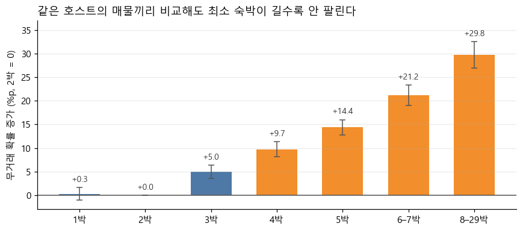

# 중기 매물(2·5번) — 최소 숙박을 3박 이하로 줄여야 하는 근거

> 전략 흐름 **① 중기 매물의 최소 숙박 하향** → ② 신규 매물 처방 → ③ 장기 숙소 타겟팅 중 **①의 근거 문서**입니다.
> 대상: `source == 0` 중 최소 숙박 4–29박 = **2번 43,293건 + 5번 33,369건 = 76,662건 (11.3%)**
> 재현: [`notebooks/midstay_min_nights.ipynb`](../notebooks/midstay_min_nights.ipynb) (이번에 새로 만든 분석) · [`notebooks/segmentation_2x3.ipynb`](../notebooks/segmentation_2x3.ipynb) 5-2 · 6장 · 7-5 (이미 해 둔 분석)
> 작성 2026-10-03

---

## 한 줄 요약

> **최소 숙박을 4박 넘게 걸면 같은 동네, 같은 집, 같은 가격, 같은 편의시설, 심지어 같은 호스트여도 덜 팔리고, 팔리던 매물도 더 자주 끊긴다. 하루 늘릴 때마다 더 나빠진다. 최소 숙박은 하한일 뿐이어서 낮춰도 주 단위 손님은 그대로 받을 수 있다. 그래서 중기 매물에는 "3박 이하로 낮추기"를 권한다.**

| | 5번 (중기 · 안 팔림) | 2번 (중기 · 팔림) |
|---|---|---|
| 주장 | 최소 숙박이 **예약을 막고 있다** | 최소 숙박 때문에 **끊길 위험이 2배**다 |
| 핵심 근거 | 같은 호스트 안에서도 무거래 **+14.1%p** · 용량-반응 | 끊김 위험 단기의 2배 (동급 그룹 96%) · 같은 호스트 안 **+8.0%p** |
| 처방 | **3박 이하로 하향** (2박이 가장 유리) | **비수기 · 빈 날짜에 3박 이하 허용** (성수기 주 단위는 유지) |
| 근거 강도 | 가장 강함 | 위험은 강함 · 매출 손실은 단정 불가 |

---

## 0. 무엇을 증명해야 하나

"최소 숙박을 줄여야 한다"고 말하려면 반론 네 개를 넘어야 합니다.

| # | 반론 | 답한 곳 | 상태 |
|---|---|---|---|
| 1 | 중기 매물이 많은 동네·집 유형이 원래 안 팔리는 것 아닌가? | 2장 동급 그룹 비교 | ✅ 기존 분석 |
| 2 | 비싸거나 편의시설이 부족해서 안 팔리는 것 아닌가? | 2장 회귀 · 4-5 상호작용 | ✅ 기존 분석 |
| 3 | **의지 약한 호스트가 최소 숙박도 길게 거는 것 아닌가? (역인과)** | **3장 같은 호스트 안 비교** | ✅ **이번에 새로 확인** |
| 4 | **2번은 지금 잘 팔리는데 왜 건드리나?** | **4장 끊김 위험** | ✅ **이번에 새로 확인** (매출 손실은 단정 불가) |

---

## 1. 원자료 — 4박부터 계단처럼 나빠진다

`source == 0`의 단기+중기 640,207건입니다.

| 최소 숙박 | 1박 | **2박** | 3박 | 4박 | 5박 | 6–7박 | 8–29박 |
|---|---:|---:|---:|---:|---:|---:|---:|
| 매물 | 313,768 | 171,809 | 77,968 | 25,845 | 20,004 | 19,251 | 11,562 |
| **무거래율** (최근 1년 리뷰 0) | 27.5% | **20.6%** | 29.5% | 33.2% | 42.5% | 52.9% | 52.8% |
| **끊김 비율** (과거에 팔렸던 매물 중 최근 1년 0) | 11.6% | **10.7%** | 15.3% | 18.4% | 23.8% | 30.4% | 27.1% |

- **무거래율**은 1–3박이 21–30%로 평평하고 2박이 가장 낮습니다. 4박부터 오르고 **6박부터는 절반 넘게 안 팔립니다.**
- **끊김 비율**은 지금 팔리는 매물에게 해당하는 위험입니다. 중기 23.8%로 단기 11.8%의 **2배**입니다.

| 중기 매물 구성 | 4박 | 5박 | 6–7박 | 8–29박 |
|---|---:|---:|---:|---:|
| 2번 (팔림) | 17,269 | 11,496 | 9,066 | 5,462 |
| 5번 (안 팔림) | 8,576 | 8,508 | 10,185 | 6,100 |

2번은 4–5박이 66%이고, 5번은 6박 이상이 49%입니다. **5번이 더 길게 걸어 둡니다.**

---

## 2. 기존 분석으로 이미 증명된 것 — 반론 1 · 2

[SEGMENTATION_2x3_VALIDATION.md](SEGMENTATION_2x3_VALIDATION.md) 2-5 · 3장 · 4-5에 있는 내용을 중기 관점으로 모았습니다.

| 질문 | 방법 | 결과 |
|---|---|---|
| 같은 동네 · 같은 집 유형이어도? | 동급 그룹(도시 × 방 타입 × 인원)마다 중기 vs 단기 (부호 검정) | **298개 중 286개(96%)** 에서 중기가 더 안 팔림. 차이 중앙값 +16.9%p |
| 가격 · 편의시설까지 맞춰도? | 로지스틱 회귀 (지역 더미 포함) | 중기 설정의 무거래 오즈비 **2.63–2.8** |
| | 동급 그룹 더미를 넣은 선형회귀 (신규 매물 제외, 이번 노트북 3-2) | 무거래 확률 **+18.4%p** (단기 21.5% 기준) |
| 길게 걸수록 더 나쁜가? | 용량-반응 (2박 = 1) | 3박 1.47 → 4박 1.83 → 5박 2.64 → 6–7박 4.00 → 8–29박 **7.86** |
| 중기가 관행인 휴양지라면? | 거래 매물의 20% 이상이 중기인 지역만 | 그래도 중기 34% vs 단기 23% (+11%p) |
| 모든 도시에서? | 지역별 비교 | **53 / 53** 지역 |
| 상품이 좋으면 괜찮지 않나? | 편의시설 수준별 단기 vs 중기 | 편의시설이 동급보다 7개 이상 많아도 **중기 29% vs 단기 15%** — 약 2배 |

→ 지역 · 집 유형 · 가격 · 편의시설로는 설명되지 않습니다. 상품을 고쳐도 중기의 불리함은 남으므로 **최소 숙박 하향은 편의시설 보완과 별개로 필요합니다.**

### 2-1. 로지스틱 회귀 원본 표

[`segmentation_2x3.ipynb`](../notebooks/segmentation_2x3.ipynb) 6장의 출력을 그대로 옮겼습니다.

**대상** 1 · 2 · 4 · 5번(단기 + 중기) · 신규 매물(호스트 경력 1년 미만 & 누적 리뷰 0) 제외 · 동급 비교 가능 · 슈퍼호스트 확인됨 → **585,601건** (무거래 23.6%)
**목표 변수** 최근 1년 리뷰 0건(무거래) = 1

| 변수 | 계수 | 오즈비 | 95% 신뢰구간 | 표준화 계수 | 해석 |
|---|---:|---:|---|---:|---|
| **중기 설정 (4–29박)** | 0.967 | **2.63** | 2.58 – 2.68 | **+0.31** | 같은 조건에서 무거래 오즈 2.6배 |
| 동급 대비 가격 (log) | 0.892 | 2.44 | 2.41 – 2.47 | +0.44 | 동급보다 2배 비싸면 무거래 오즈 1.86배 |
| 동급 대비 편의시설 (+5개) | −0.142 | 0.868 | 0.865 – 0.870 | −0.41 | 5개 많을 때마다 무거래 오즈 13% 감소 |
| 통집 | −0.841 | 0.431 | 0.424 – 0.438 | −0.32 | |
| 지역 계절성 지수 (+0.1) | 0.120 | 1.13 | 1.12 – 1.13 | +0.27 | 휴양지일수록 무거래 |
| 슈퍼호스트 *(통제)* | −1.278 | 0.278 | 0.274 – 0.283 | −0.61 | ⚠️ 해석 금지 — 실적이 있어야 받는 자격이라 역인과 |
| 옛 편의시설 이름 체계 *(통제)* | 0.265 | 1.30 | 1.28 – 1.33 | +0.10 | 편의시설 목록 갱신 여부 통제 |
| 새 편의시설 이름 체계 *(통제)* | −0.100 | 0.905 | 0.891 – 0.920 | −0.05 | 위와 동일 |

<sub>노트북 출력은 계절성 지수 +1 단위(오즈비 3.32)입니다. 읽기 쉽게 +0.1 단위로 바꿨습니다(3.32^0.1 = 1.13).</sub>

- **오즈비** — 안 팔릴 가능성이 몇 배가 되나. 1이면 영향 없음. 평균적인 매물(무거래 23.6%)에서 오즈비 2.63은 대략 **24% → 45%** 입니다.
- **표준화 계수** — 단위가 다른 변수끼리 영향의 크기를 비교한 값입니다. 중기 설정(+0.31)은 가격(+0.44) · 편의시설(−0.41)보다 조금 작고 통집(−0.32)과 비슷한 크기입니다.
- **처음 보는 도시에서도 맞나** — 도시 단위 5겹 교차검증 AUC **0.754** (겹별 0.731 · 0.761 · 0.764 · 0.738 · 0.773). 학습에 쓰지 않은 도시에서도 똑같이 통합니다.
- **지역을 더미로 넣어도** — 계절성 지수 대신 지역 더미 53개를 넣으면 중기 설정 오즈비가 **2.80**입니다. 나머지도 거의 그대로입니다(가격 2.47 · 편의시설 0.863 · 통집 0.432).
- **확률로 바꾸면** — 지역 더미 모델로 중기 매물 69,612개의 거래 확률을 예측하면 평균 **60%** 입니다. 다른 조건은 그대로 두고 '중기 여부'만 0(단기)으로 바꾸면 **78%** 가 됩니다(+18%p). 발표에서는 오즈비 대신 이 숫자를 씁니다.

  <sub>2026-10-03 재계산: 위 표의 통제 변수 중 동급 대비 가격 · 편의시설 · 통집 · 슈퍼호스트 + 지역 더미만 넣은 간소화 모델(같은 585,601건, 중기 오즈비 2.79). 실측 거래 확률 60.4% → 예측 78.1%.</sub>

### 2-2. 용량-반응 원본 표

위 모델에서 중기 설정 변수 대신 최소 숙박 구간마다 더미를 넣었습니다. 2박이 기준이고 지역 더미를 포함합니다.

| 최소 숙박 | 오즈비 (2박 대비) | 95% 신뢰구간 | 매물 |
|---|---:|---|---:|
| 1박 | 0.995 | 0.978 – 1.012 | 279,073 |
| 2박 | 1 (기준) | | |
| 3박 | 1.47 | 1.44 – 1.50 | 73,331 |
| 4박 | **1.83** | 1.77 – 1.89 | 24,130 |
| 5박 | **2.64** | 2.55 – 2.74 | 18,355 |
| 6–7박 | **4.00** | 3.86 – 4.15 | 16,755 |
| 8–29박 | **7.86** | 7.49 – 8.25 | 10,372 |

신뢰구간이 서로 겹치지 않고 **하루 늘릴 때마다 단조롭게 커집니다.** 같은 호스트 안에서도 같은 모양이 나옵니다(3장 ③).

### 2-3. 편의시설과의 상호작용 원본 표

위 모델에 "중기 설정 × 동급 대비 편의시설" 상호작용항을 넣었습니다.

- 상호작용 오즈비 **0.985** (95% 신뢰구간 0.979 – 0.991). 통계적으로는 0이 아니지만 크기는 사실상 없습니다.

| 동급 대비 편의시설 | −12개 이하 | −11 ~ −6 | −5 ~ 0 | +1 ~ +6 | +7개 이상 |
|---|---:|---:|---:|---:|---:|
| 단기 무거래율 | 37.4% | 24.1% | 20.0% | 16.6% | 14.9% |
| 중기 무거래율 | 59.4% | 42.6% | 36.8% | 32.6% | 29.1% |
| 중기 ÷ 단기 | 1.59배 | 1.76배 | 1.84배 | 1.97배 | 1.95배 |

→ 편의시설이 좋아도 중기의 불리함은 사라지지 않습니다. 배수로는 오히려 편의시설이 좋을수록 커집니다. **"중기 설정은 상품이 받쳐 주면 괜찮다"는 성립하지 않습니다.**

---

## 3. 새로 확인 — 같은 호스트 안에서도 그런가 (반론 3)

### 왜 필요한가

기존 문서는 "**활동 의지가 약한 호스트가 최소 숙박도 길게 잡는다**"는 역방향 설명을 배제할 수 없다고 적었습니다. 이 반론이 맞다면, 같은 호스트의 매물끼리 비교했을 때 차이가 사라져야 합니다. **호스트의 의지 · 역량 · 운영 방식은 같은 사람 안에서는 똑같기 때문**입니다.

### 무엇을 했나

단기 매물과 중기 매물을 **둘 다 가진 호스트 9,105명**(매물 77,094건)만 골라, 각 호스트 안에서 단기 매물과 중기 매물을 비교했습니다. 두 가지 방법을 썼습니다.

1. **단순 비교 + 부호 검정** — 호스트마다 단기 매물과 중기 매물의 무거래율을 비교하고, 중기 쪽이 더 나쁜 호스트가 몇 명인지 셉니다.
2. **호스트 더미를 넣은 선형회귀** — 가격 · 편의시설 차이까지 맞추기 위해 회귀를 씁니다. 아래 박스에 쉽게 풀었습니다.

> **호스트 더미를 넣은 선형회귀란** (통계 용어로는 "호스트 고정효과")
>
> ```
> 무거래(0/1) = b × 중기 설정 + c × 동급 대비 가격 + d × 동급 대비 편의시설 + e × 통집
>              + (호스트 A 더미) + (호스트 B 더미) + … (호스트 8,951명분)
> ```
>
> - **호스트 더미**가 "이 호스트는 원래 잘 파는 사람인가"를 호스트마다 흡수합니다. 운영 의지 · 역량처럼 **사람에 붙은 차이는 전부 더미가 가져갑니다.**
> - 그래서 남은 `b`는 **같은 호스트 안에서** 중기 매물이 단기 매물보다 얼마나 더 안 팔리는지만 뜻합니다.
> - 결과가 0/1이라 `b`는 바로 **확률 차이(%p)** 로 읽습니다. `b = 0.141`이면 "무거래 확률이 14.1%p 높다"입니다.
> - 더미 8,951개를 실제로 넣는 대신, 각 매물 값에서 그 호스트의 평균을 빼고 회귀를 돌렸습니다. 수학적으로 같은 결과입니다.
>
> **신뢰구간은 호스트 단위로 계산했습니다.** 같은 호스트의 매물은 서로 닮아서, 매물 20채를 올린 호스트는 독립된 정보 20개가 아니라 "한 사람의 운영 방식" 하나에 가깝습니다. 그래서 같은 호스트의 매물을 한 덩어리로 보고 신뢰구간을 계산했습니다(군집 강건 표준오차). 일반 방식보다 구간이 넓어지는, **보수적인** 쪽입니다. 효과 크기(+14.1%p) 자체는 이 방식과 상관없이 같습니다.

### 결과

**① 단순 비교**

| | 단기 매물 | 중기 매물 |
|---|---:|---:|
| 호스트 평균 무거래율 | 26.7% | **41.5%** |

- 차이가 난 호스트 4,539명 중 **3,094명(68%)** 에서 중기 매물이 더 안 팔렸습니다(부호 검정 p ≈ 10⁻¹³⁵).
- **2채만 가진 개인 호스트**(3,700명)에서도 72%입니다. 같은 사람이 집 두 채를 올렸는데 최소 숙박을 길게 건 쪽이 덜 팔립니다.

**② 가격 · 편의시설 · 통집까지 맞춘 비교 (호스트 더미를 넣은 선형회귀, 신규 매물 제외)**

| 비교 범위 | 매물 | 중기 설정의 무거래 확률 효과 | 95% 신뢰구간 |
|---|---:|---:|---|
| 같은 호스트 안 | 73,078 (호스트 8,951명) | **+14.1%p** (단기 27.3% 기준) | 13.0 – 15.2 |
| 같은 호스트 · **같은 동급 그룹** 안 | 73,078 (묶음 23,769개) | **+13.0%p** | 11.9 – 14.2 |

<sub>두 번째 줄은 더미를 "호스트 × 동급 그룹" 묶음마다 넣은 것입니다. 같은 사람이 같은 도시에 올린 같은 크기 · 같은 방 타입의 매물끼리만 비교합니다.</sub>

**③ 같은 호스트 안 용량-반응** (2박 = 0, 가격 · 편의시설 · 통집 통제)

중기 설정 변수 하나 대신 최소 숙박 구간마다 더미(1박 · 3박 · 4박 · 5박 · 6–7박 · 8–29박)를 넣고, 2박을 기준으로 둔 같은 회귀입니다.



| 최소 숙박 | 1박 | **2박** | 3박 | 4박 | 5박 | 6–7박 | 8–29박 |
|---|---:|---:|---:|---:|---:|---:|---:|
| 무거래 확률 증가 | +0.3%p | **0** | +5.0%p | +9.7%p | +14.4%p | +21.2%p | **+29.8%p** |
| 95% 신뢰구간 | −1.1 – 1.6 | | 3.6 – 6.3 | 8.1 – 11.3 | 12.7 – 16.0 | 19.0 – 23.3 | 27.0 – 32.5 |

<sub>2박 매물의 무거래율 21.8% 기준. 그림은 노트북 4-4에서 그렸습니다.</sub>

```
2박   |                                        0
3박   ■■■■■                                  +5.0%p
4박   ■■■■■■■■■■                             +9.7%p
5박   ■■■■■■■■■■■■■■                         +14.4%p
6–7박 ■■■■■■■■■■■■■■■■■■■■■                  +21.2%p
8–29박 ■■■■■■■■■■■■■■■■■■■■■■■■■■■■■■         +29.8%p
```

### 해석

- **역인과 반론으로는 설명되지 않습니다.** 같은 사람의 매물끼리 비교해도 차이가 남고, 크기도 동급 비교(+18.4%p)와 큰 차이가 없습니다(+13–14%p). 차이는 호스트가 아니라 **매물 설정**에 붙어 있습니다.
- 하루씩 늘릴 때마다 계단처럼 커지는 모양도 같은 호스트 안에서 그대로 나옵니다.
- **인과를 증명한 것은 아닙니다.** 다만 가장 강한 대안 설명(호스트 차이)을 데이터로 배제했습니다. 발표 표현은 "**같은 호스트의 매물끼리 비교해도 최소 숙박이 긴 매물이 일관되게 덜 팔린다**"입니다.

---

## 4. 새로 확인 — 2번은 팔리는데 왜 줄이나 (반론 4)

### 2번에 대해 이미 알고 있던 것

[SEGMENTATION_2x3.md](SEGMENTATION_2x3.md)는 2번을 "**문제라고 단정할 수 없음**"으로 두었습니다. 예약은 적지만 한 번에 길게 묵어서, 매출로 바꾸면 가정에 따라 결론이 뒤집히기 때문입니다. 이번에 같은 호스트 비교를 더해도 이 점은 그대로입니다.

| 팔리는 매물끼리 중기 ÷ 단기 | 같은 동급 그룹 (285개) | 같은 호스트 (5,378명) |
|---|---:|---:|
| 예약 수 (최근 1년 리뷰) | **0.40배** (그룹 94%에서 중기가 적음) | **0.67배** (65%) |
| 추정 숙박일 | 0.85배 | 1.11배 |
| 추정 연매출 | 0.73배 | 1.10배 |

<sub>추정 숙박일 = 리뷰 ÷ 0.5 × max(최소 숙박, 3). 손님이 최소 숙박만큼 묵는다고 가정해 중기에 유리하게 잡은 값입니다.</sub>

→ **"2번은 지금 손해를 보고 있다"고는 말하지 않습니다.** 대신 근거를 **위험**과 **기회**로 바꿉니다.

### 근거 ① 위험 — 2번은 끊길 확률이 2배다

과거에 한 번이라도 팔린 매물 중, 최근 1년 거래가 끊긴 비율입니다.

| 비교 | 결과 |
|---|---|
| 원자료 | 중기 **23.8%** vs 단기 11.8% (2배) |
| 같은 동급 그룹 | 268개 중 **258개(96%)** 에서 중기가 더 많이 끊김. 차이 중앙값 +11.6%p |
| 동급 그룹 더미를 넣은 선형회귀 (가격 · 편의시설 통제) | **+12.7%p** |
| **같은 호스트 안** — 호스트 더미를 넣은 선형회귀 (가격 · 편의시설 · 통집 통제) | **+8.0%p** (단기 11.3% 기준 → 약 1.7배) |
| 최소 숙박별 | 2박 10.7% → 4박 18.4% → 5박 23.8% → 6–7박 30.4% |

**2번은 5번으로 넘어가는 길목입니다.** 지금은 팔리지만, 같은 조건의 단기 매물보다 거래가 끊길 가능성이 2배이고, 끊기면 5번이 됩니다.

> ⚠️ 한 시점 데이터라 "끊긴 뒤에 최소 숙박을 늘렸다"는 순서를 완전히 배제할 수는 없습니다. 끊긴 매물의 호스트가 설정을 길게 바꿀 이유는 약하므로 가능성은 낮다고 봅니다.

### 근거 ② 기회 — 최소 숙박은 하한일 뿐이다

| | 1번 (단기 · 팔림) | 2번 (중기 · 팔림) |
|---|---:|---:|
| 예약 가능일 (365일 중) | 223일 | **181일** |
| 최근 1년 리뷰 중앙값 | 9건 | **4건** |
| 리뷰 기반 가동률 중앙값 | 14.8% | **11.0%** |

- 2번은 **달력을 1년에 181일 열어 두고도** 예약은 1번의 절반 이하입니다.
- **최소 숙박을 3박으로 낮춰도 7박 손님은 7박을 그대로 예약할 수 있습니다.** 최소 숙박은 하한이지 상한이 아닙니다.
- 단, 손해가 전혀 없지는 않습니다. ① 손님이 바뀔 때마다 청소 · 체크인 부담이 늘고 ② **성수기에 2박 예약이 한 주의 가운데를 차지하면 7박 예약을 못 받을 수 있습니다.** 그래서 2번에는 전면 하향이 아니라 아래처럼 **비수기와 예약 사이 빈 날짜**에만 낮추라고 권합니다. 예약 사이에 4박 미만으로 남은 날짜는 지금 설정으로는 **아예 팔 수 없는 날**이므로, 여기를 여는 것은 잃는 것이 없습니다.
- 같은 동급 그룹에서 단기 매물은 예약을 2.5배 받습니다. 그 수요가 2번 근처에 있다는 뜻입니다.

### 그래서 2번 처방은 5번보다 약하게

2번은 경력 7년 · 1채 보유 개인 호스트가 휴양지 별장을 주 단위로 파는 칸입니다(SEGMENTATION_2x3 2번 카드). 성수기 주 단위 운영을 막을 이유는 없습니다.

> **2번 처방** — "성수기 주 단위는 그대로 두고, **비수기와 예약 사이 빈 날짜에는 3박 이하를 허용**하세요." 기간별로 최소 숙박을 다르게 설정하도록 안내합니다.

---

## 5. 처방

| | 5번 (33,369건) | 2번 (43,293건) |
|---|---|---|
| 메시지 | "최소 숙박을 **3박 이하**로 낮추세요" | "**비수기 · 빈 날짜**에 3박 이하를 허용하세요" |
| 함께 보여줄 근거 | 같은 조건 매물 중 3박 이하의 무거래율 · 하루 늘릴 때마다 무거래 확률 증가분 | 같은 조건 매물의 끊김 비율 · 단기 매물의 예약 수 |
| 권장 값 | 2박이 가장 유리 (3박도 2박보다 +5.0%p) | 4박 → 3박부터 |
| 덧붙임 | 편의시설 부족분 (편의시설이 좋아도 중기는 2배 덜 팔림 → 둘 다 고쳐야 함) | — |
| 실행 | 호스트 알림 · 설정 화면 기본값 안내 | 기간별 최소 숙박 설정 안내 |

**왜 레버가 좋은가**
1. **설정값 하나**라 호스트 비용이 거의 없습니다. 편의시설 구매나 가격 인하와 다릅니다.
2. **본사가 바로 실행**할 수 있고 규제(외부 변수)와 무관합니다. 단기 임대 규제 도시의 30박+ 매물(3번)은 대상이 아닙니다 — 이 문서의 대상은 4–29박뿐입니다.
3. **가격을 건드리지 않습니다.** 객단가를 낮추지 않고 가동률을 올리는 방향이라 수수료(거래액 × 15.5%)와 바로 연결됩니다.

---

## 6. 기대 효과 — 시나리오

> 연관을 인과처럼 적용한 **상한에 가까운 추정**입니다. 발표에서는 범위로만 제시하세요.

**공통 가정** — 매물 1건 연매출 = 1박 가격 × 리뷰 기반 가동률 × 365 × **0.85**(성수기 견적 보정: 비성수기 견적은 동급 대비 0.85배) · 수수료 15.5%

### 5번 — 새로 팔리기 시작하는 매물

같은 호스트 안 용량-반응(3장 ③)을 그대로 적용합니다. 예: 6–7박 매물을 3박으로 낮추면 무거래 확률 21.2 − 5.0 = **16.2%p 감소**.

- 대상: 5번 중 신규 매물 제외 **29,659건** (신규 3,710건은 팀원의 신규 매물 처방으로)
- 3박으로 낮출 때 평균 판매 확률 **+13.1%p** → 전원 참여 시 **약 3,900건이 새로 팔림**

| 호스트 참여율 | 새로 팔리는 매물 | 연 수수료 — 보수 (2번 하위 25% 매출 3,401€) | 연 수수료 — 기준 (2번 중앙값 7,489€) |
|---|---:|---:|---:|
| 30% | 약 1,160건 | 약 52만 € | 약 114만 € |
| 50% | 약 1,940건 | 약 87만 € | 약 191만 € |
| 100% | 약 3,880건 | 약 173만 € | 약 381만 € |

### 2번 — 끊기지 않게 지키는 수수료

- 2번이 만드는 연 수수료 합계(보정 후) **약 7,300만 €**
- 같은 호스트 안 끊김 위험 차이 **8.0%p**를 단기 수준으로 낮추면 → **약 180만 € (참여 30%) – 580만 € (전원)** 이 위험에서 빠집니다.

> ⚠️ 끊김 비율은 1년 단위가 아니라 매물 생애 동안의 누적 비율입니다. 이 값은 "매년 지키는 금액"이 아니라 **위험에 노출된 규모**로 읽으세요.

---

## 7. 말해도 되는 것과 안 되는 것

| ✅ 말해도 된다 | ❌ 말하면 안 된다 |
|---|---|
| "같은 호스트의 매물끼리 비교해도 최소 숙박이 긴 매물이 덜 팔린다" | "최소 숙박을 낮추면 팔린다" (인과) |
| "하루 늘릴 때마다 무거래 확률이 계단처럼 오른다 (2박 대비 4박 +9.7%p, 6–7박 +21.2%p)" | "2번은 지금 매출 손해를 보고 있다" (가정에 따라 0.73–1.10배) |
| "동급 그룹 96%, 53개 지역 전부에서 같은 방향" | "중기 설정은 상품이 받쳐 주면 괜찮다" (기각됨) |
| "2번은 같은 조건 단기 매물보다 끊길 위험이 2배" | "기대 효과 X억 원" 단일 값 (범위로만) |
| "최소 숙박은 하한이라 낮춰도 장기 손님은 그대로 받는다" (단 성수기 달력 쪼개짐은 인정) | 30박+ 매물까지 낮추라는 말 (3번은 규제 도시의 정상 장기 체류) |

---

## 8. 예상 질문과 답

**Q. 의지가 약한 호스트가 최소 숙박도 길게 거는 것 아닌가요?**
같은 호스트가 가진 매물끼리 비교했습니다. 단기·중기 매물을 둘 다 가진 호스트 9,105명 안에서도 중기 매물이 무거래율 41.5% vs 26.7%로 더 안 팔리고, 가격·편의시설을 맞춰도 +14%p입니다. 호스트가 같으니 의지 차이로는 설명되지 않습니다.

**Q. 2번은 한 번에 길게 묵으니 매출은 비슷하지 않나요?**
맞습니다. 그래서 2번이 손해라고는 하지 않습니다. 대신 2번은 같은 조건의 단기 매물보다 거래가 끊길 위험이 2배입니다(동급 그룹 96%). 그리고 최소 숙박은 하한일 뿐이라 낮춰도 장기 손님은 그대로 받을 수 있습니다. 2번에는 비수기와 예약 사이 빈 날짜만 열라고 하므로 성수기 주 단위 매출은 건드리지 않습니다.

**Q. 짧은 예약이 달력을 쪼개서 일주일 예약을 못 받게 되지 않나요?**
성수기에는 그럴 수 있습니다. 그래서 2번은 성수기 주 단위를 유지하고, 비수기와 예약 사이 빈 날짜만 엽니다. 예약 사이에 3박이 남았는데 최소 숙박이 4박이면 그 3박은 지금 설정으로는 아예 팔 수 없는 날입니다.

**Q. 휴양지는 원래 주 단위로 빌리는 문화 아닌가요?**
중기가 흔한 지역(거래 매물의 20% 이상이 중기)만 봐도 중기 34% vs 단기 23%로 더 안 팔립니다. 그래서 2번에는 성수기 주 단위는 유지하고 비수기·빈 날짜만 낮추라고 권합니다.

**Q. 3박도 2박보다 덜 팔리는데 왜 "3박 이하"인가요?**
같은 호스트 안에서 3박은 2박보다 +5.0%p, 4박은 +9.7%p입니다. 3박까지는 기울기가 완만하고 4박부터 가팔라집니다. 알림에서는 "3박 이하, 가능하면 2박"으로 안내합니다.

**Q. 손님이 자주 바뀌면 호스트 청소비 부담이 늘지 않나요?**
늘어납니다. 그래서 5번(1년간 한 건도 안 팔린 매물 — 청소할 손님 자체가 없음)은 확실히 낮추고, 2번은 비수기·빈 날짜에만 낮추도록 강도를 나눴습니다.

**Q. 효과가 얼마인가요?**
5번만 보면 참여율 30–100%에서 연 수수료 약 50만–380만 €, 2번의 끊김 위험에 노출된 수수료가 약 180만–580만 €입니다. 둘 다 연관을 인과처럼 적용한 추정이라 범위로만 말합니다.

---

## 재현

```bash
python scripts/build_master.py                 # data/processed/ 생성 (없을 때만)
# notebooks/midstay_min_nights.ipynb 를 위에서부터 실행
```

| 이 문서 | 노트북 |
|---|---|
| 1장 원자료 | `midstay_min_nights` 1–2장 |
| 2장 기존 증거 | `segmentation_2x3` 5-2 · 6-2 ~ 6-4 · 7-2 · 7-5, `midstay_min_nights` 3장 |
| 3장 같은 호스트 안 비교 | `midstay_min_nights` 4장 |
| 4장 2번 | `midstay_min_nights` 2-1 · 3장 · 4-2 · 5장 |
| 6장 기대 효과 | `midstay_min_nights` 6장 |
